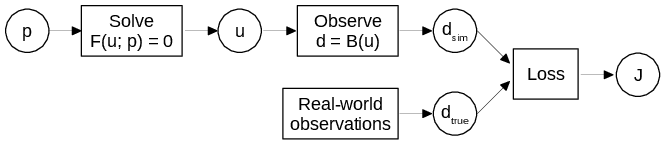
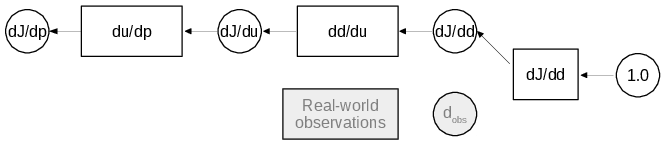
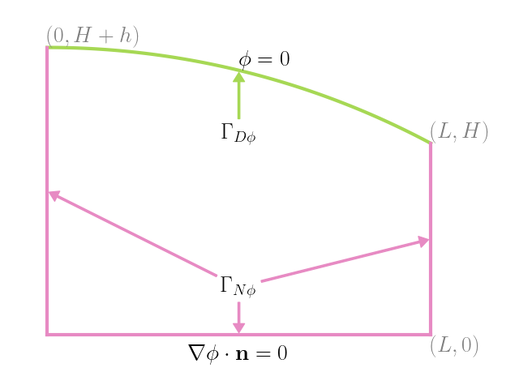
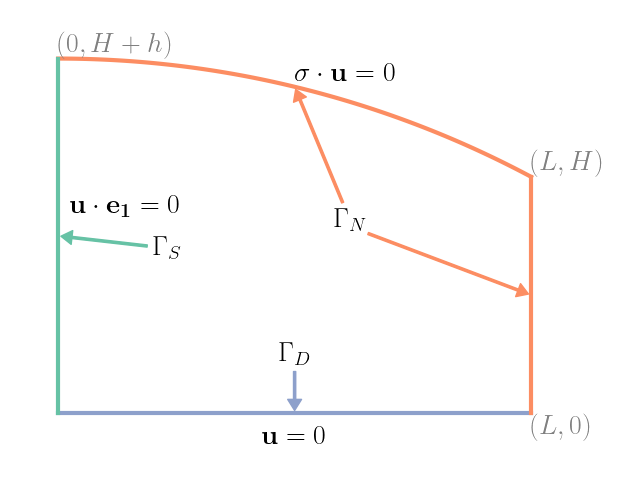
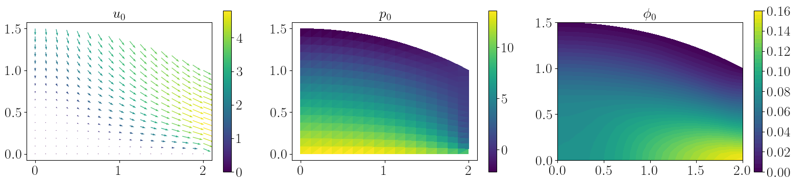
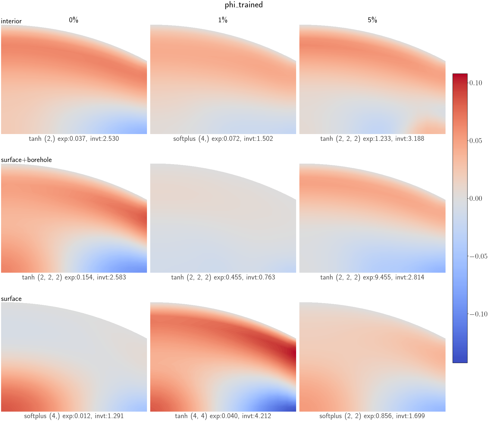

This project earned me much Python and automatic differentiation experience.

CRIKit (2019-2023)

- Developed a software framework to enable training and testing complex CRs (constitutive relations) in material science.
- Integrated automatic differentiation frameworks with Pyadjoint, thus allowing seamless use of diverse CR implementations.
- Investigated CR parametrizations that respect physical symmetries and invariants, thus increasing generalizability.

Code [here](https://gitlab.com/crikit/crikit)

::: {#fig-domain layout-ncol=1}

When computing the loss, information flows from parameters $p$ to loss $J$, with intermediate computations of the PDE output $u$ and the observable quantity $d$.
For computing the parameter gradient, information flows backward from $J$ to $p$.
Even though the matrix $\frac{du}{dp}$ grows quadratically with the problem size, applying its adjoint to $\frac{dJ}{du}$ is cheap.
This allows scalable gradient-based optimization of the parameters $p$ when $p$ is high-dimensional compared to the loss $J$.

:::

::: {#fig-domain layout-ncol=2}

Boundary conditions for a 2D vertical slice of a large mound of ice.

:::

{#fig-ground-truth}

{#fig-learned}

<!-- TODO crikit math -->
