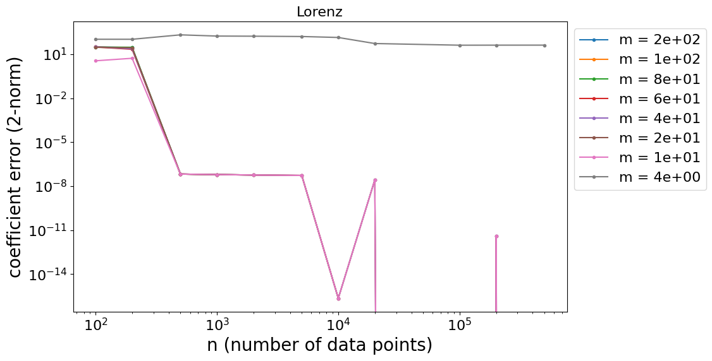
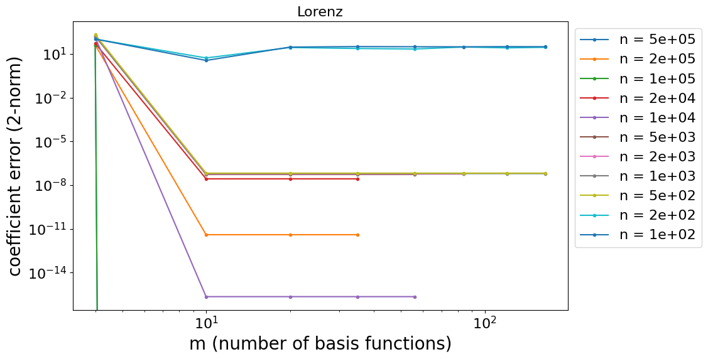
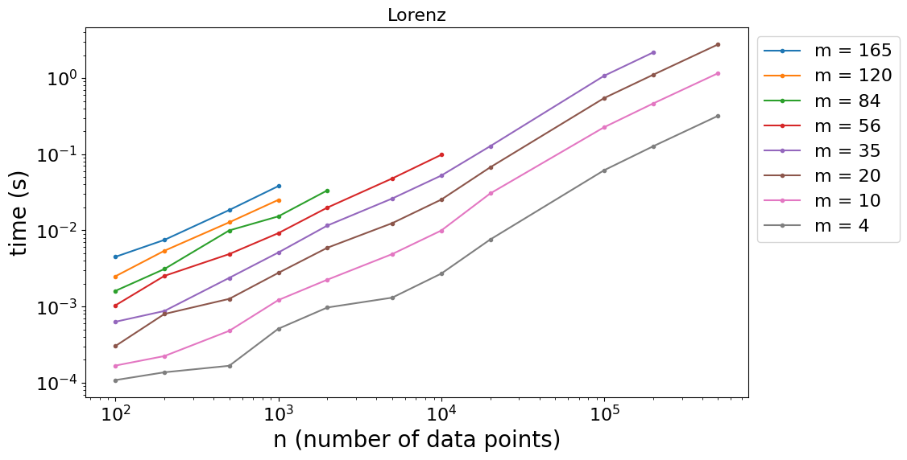
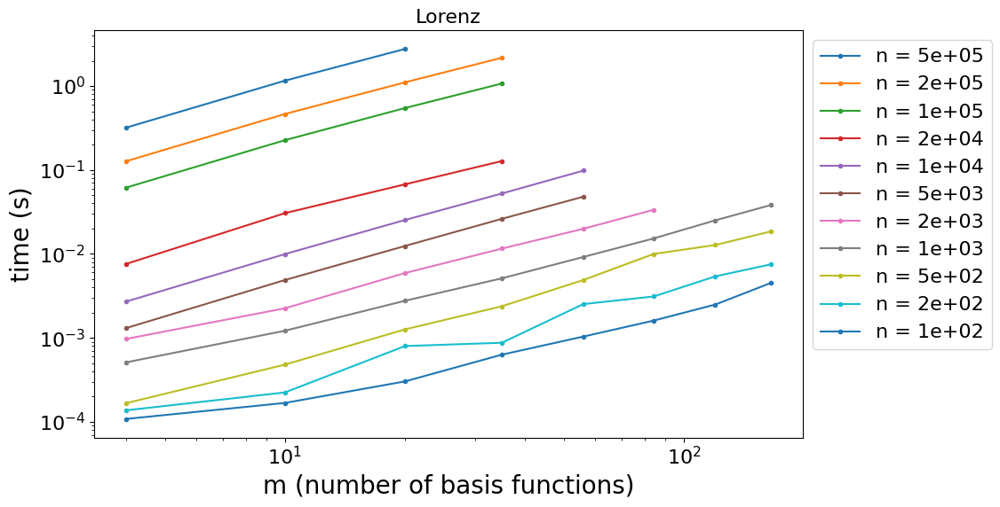
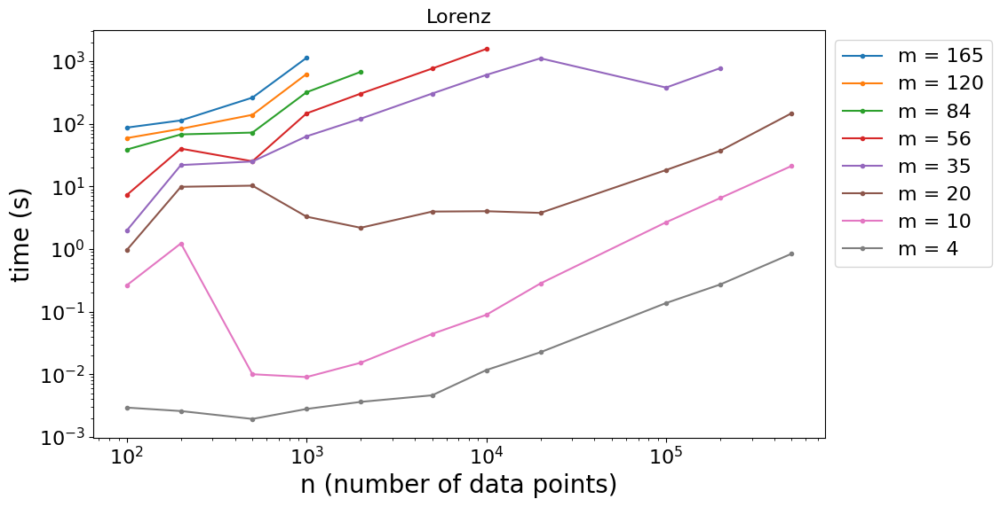
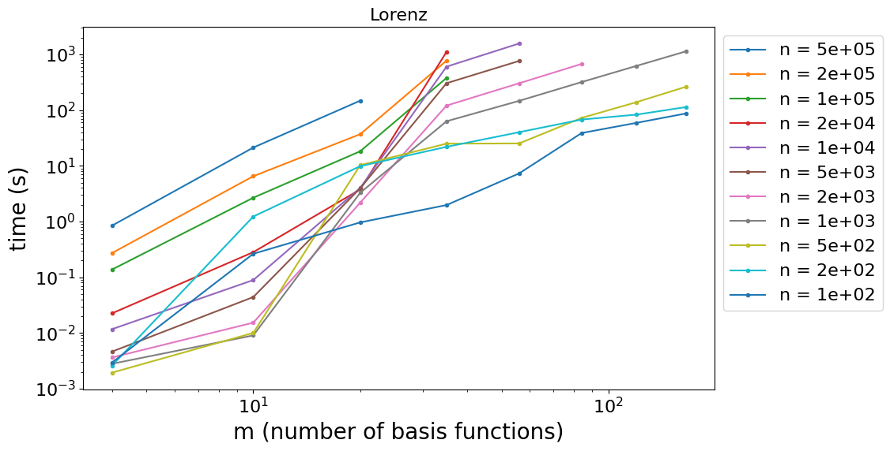
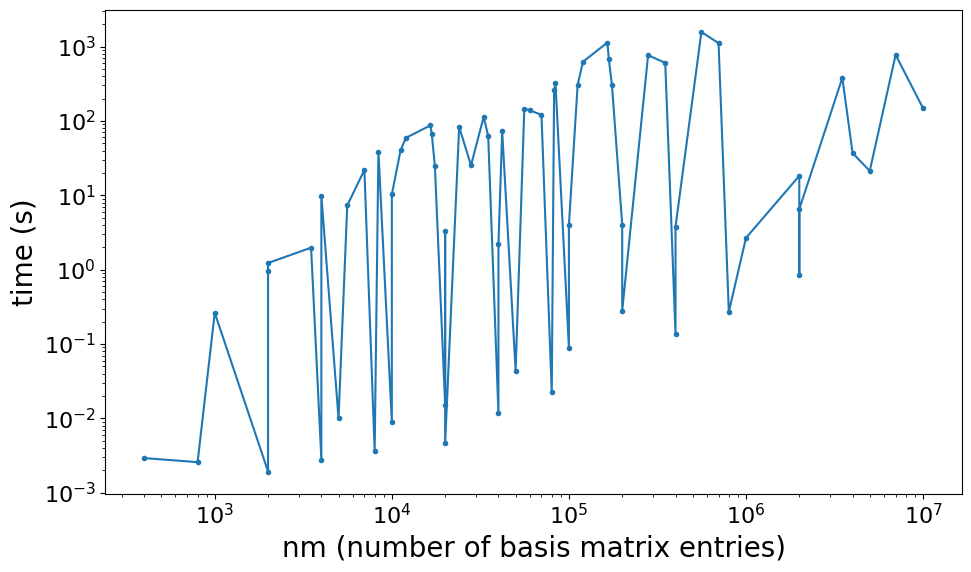

Implementing the SINDy algorithm in PETSc.

The code is in the PETSc repo [here](https://gitlab.com/petsc/petsc/-/compare/main...gbruer%2Fsindy?from_project_id=13882401).

# Mathematical theory

This discussion is based on @brunton2016sindy and
@shea2020sindy-bvp. I'm going to try to outline the general case.
$$\begin{align}
\mathbf{u} &= \mathbf{u}(\mathbf{x}, t) \\
\frac{d\mathbf{u}}{dt} &= \frac{d\mathbf{u}}{dt}(\mathbf{u}, \mathbf{x}, t)
\end{align}$$ for
$\mathbf{u} \in \mathbb{R}^{d_u}, \,\, \mathbf{x} \in \mathbb{R}^{d_x}, \,\, t \in \mathbb{R}$.
The goal of SINDy is to represent $\frac{d\mathbf{u}}{dt}$ in a basis
$B$ of size $p$ with sparse coefficients $\mathbf{c} \in \mathbb{R}^p$.
$$\begin{equation}
\frac{d\mathbf{u}}{dt} \approx \sum_{i=1}^p c_i \mathbf{b_i}(\mathbf{u},\mathbf{x},t)
\end{equation}$$ {#eq-dudt-approx}
$$\begin{align}
b_i \in B = \{\mathbf{1}, \mathbf{u}, \mathbf{x}, t, \mathbf{u}^2, \mathbf{u}\mathbf{x},\mathbf{u}t,\mathbf{x}^2,\mathbf{x}t,t^2,\ldots,\sin\mathbf{u},\cos{\mathbf{u}}, \frac{\partial\mathbf{u}}{\partial \mathbf{x}},\ldots\}
\end{align}$$ This will generally be represented as a linear system with
discretized $\mathbf{U}$ and $\mathbf{X}$, with the columns of the
matrix $\Theta$ represented basis functions evaluated at specific
$\mathbf{X}$ and $t$. $$\begin{equation}
\frac{d\mathbf{U}}{dt} \approx \Theta(\mathbf{U}, \mathbf{X}, t) \mathbf{c}
\end{equation}$$ {#eq-basis-system}

Note that when $d_x \ne 1$ or $d_u \ne 1$, the vector terms in the basis
shown above aren't mathematically well-defined, but the idea is to
include polynomial terms, and these can also include polynomial terms of
separate components of the vector, and cross terms of those components.
The functions shown in the basis above are just examples; the main idea
is that the basis can have any kind of functions of $\mathbf{u}$,
$\mathbf{x}$, and $t$.

Also note that, as far as the algorithm goes, it does not matter what is
on the left-hand side. The algorithm does not take advantage of it being
a time derivative of something. It could be a time derivative
[@brunton2016sindy] or a spatial derivative [@shea2020sindy-bvp], or
it could just be any variable that you want to have a sparse
representation for (citation needed). Similarly, since the basis
functions can be anything, the basis matrix $\Theta$ could be a function
of any variables. At its core SINDy is just sparse regression. The
following sections discuss how to set up the specific case of having
vector-valued outputs with coordinates.

## Integral formulation

Since derivatives can give noisy data, there is an alternative integral
formulation described in @schaeffer2017integral that can be obtained
by integrating
@eq-dudt-approx over time. $$\begin{equation}
\mathbf{u}(t) - \mathbf{u}(0) \approx \sum_{i=1}^p c_i \int_0^t \mathbf{b_i}(\mathbf{u}(\mathbf{x},\tau),\mathbf{x},\tau) \,\, d\tau
\end{equation}$$ This leads to a matrix formulation in the same form as
@eq-basis-system where the basis functions are replaced with
an integral and the left-hand side is replaced by
$\mathbf{U}(t) - \mathbf{U}(0)$. The integrals can be approximated with
something as simple as piecewise constant quadrature. Assuming the input
data $\mathbf{u}$ is collected at regularly spaced times $t_k$, the
integral can be computed as: $$\begin{equation}
\int_0^t \mathbf{b_i}(\mathbf{u}(\mathbf{x},\tau),\mathbf{x},\tau) \,\, d\tau \approx \Delta t \sum_{i=1}^k \mathbf{b_i}(\mathbf{u}(\mathbf{x},t_i),\mathbf{x},t_i)
\end{equation}$$

## Simplest dimensional case, $d_x = 0$ and $d_u = 1$ {#section:simplest}

To get to a multi-dimensional formulation, I'll start out by describing
the case when $d_x = 0$ and $d_u = 1$. $$\begin{align*}
u &= u(t) \\
\frac{du}{dt} &= \frac{du}{dt}(u, t)
\end{align*}$$ In this case, the collected data will be a
one-dimensional set of values of $u$ at different times. Let $m$ be the
number of data points, and $\mathbf{U} \in
\mathbb{R}^m$ be the set of data points, where $U_k$ is the $k$-th
measurement of $u$, with a corresponding derivative
$\frac{d\mathbf{U}}{dt}$. Let $\mathbf{B_i} \in
\mathbb{R}^m$ be the $i$-th basis function evaluated at all $m$ data
points, such that $B_{k,i}$ is the basis function evaluated at the
$k$-th measurement. Then the equation to solve is the following:
$$\begin{equation*}
\frac{d\mathbf{U}}{dt} \approx \sum_{i=1}^p c_i \mathbf{B_i}
\end{equation*}$$ This can be written as a matrix multiplication, where
$\mathbf{B_i}$ are the columns of $\Theta \in \mathbb{R}^{m \times p}$.
$$\begin{equation}
\frac{d\mathbf{U}}{dt} \approx \Theta \mathbf{c}
\end{equation}$$ This can be solved for a sparse $\mathbf{c}$ with a
sparse least squares solver. In this case the basis functions are
functions of the two variables $u$ and $t$.

## More outputs, $d_x = 0$ and $d_u \ge 1$ {#section:more-outputs}

When $\mathbf{u}$ is a vector, each measurement will have $d_u$ values.
In this case the basis functions can be made of functions of the $d_u+1$
variables $u_1,u_2,\ldots,u_{d_u}$ and $t$. To obtain separate sparse
coefficients for each output $\frac{du_i}{dt}$, the sparse regression
can be performed on each output dimension separately. Let
$\mathbf{U_i} \in \mathbb{R}^{m}$ be the measurements for output $i$ and
$\mathbf{c_i} \in \mathbb{R}^p$ be the coefficients for output $i$. Then
we can solve the equation below to find all the coefficients.
$$\begin{equation}
\frac{d\mathbf{U_i}}{dt} \approx \Theta \mathbf{c_i} \,\,\ \text{ for $i \in \{1,2,\ldots,d_u\} $}
\end{equation}$$ {#eq-same-theta-eqs}

This can be structured as a single matrix equation by letting
$\mathbf{U_i}$ be the columns of the matrix
$\mathbf{U} \in \mathbb{R}^{m \times d_u}$, and $\mathbf{c_i}$ be the
columns of the matrix $\mathbf{c} \in \mathbb{R}^{p \times d_u}$. Then
the equation becomes the following: $$\begin{equation*}
\frac{d\mathbf{U}}{dt} \approx \Theta \mathbf{c}
\end{equation*}$$ This formulation makes each output $u_i$ depend on the
same set of basis functions, stored in $\Theta$. To write it as a single
matrix equation but allow each $u_i$ to have a different set of basis
functions, a block diagonal structure can be used.

Let $\Theta^{(i)} \in \mathbb{R}^{m \times p_i}$ be the data for the
$p_i$ basis functions to use for output $u_i$. Let $p = \sum p_i$ be the
total number of basis functions. Then the block diagonal matrix
$\Theta' \in \mathbb{R}^{md_u \times p}$ can be constructed using
$\Theta^{(i)}$ along the diagonal. Then flatten the data $\mathbf{U}$
into a vector $\mathbf{U'} \in \mathbb{R}^{md_u}$ and flatten the
coefficients $\mathbf{c}$ into a vector
$\mathbf{c}' \in \mathbb{R}^{p}$. $$\begin{equation}
\frac{d\mathbf{U'}}{dt} = 
\begin{bmatrix}
\frac{d\mathbf{U_1}}{dt} \\ \frac{d\mathbf{U_2}}{dt} \\ \vdots \\ \frac{d\mathbf{U_{d_u}}}{dt}
\end{bmatrix}
\approx
\begin{bmatrix}
\Theta^{(1)} \\
& \Theta^{(2)} \\
& & \ddots \\
& & & \Theta^{(d_u)} \\
\end{bmatrix}
\begin{bmatrix}
\mathbf{c_1} \\ \mathbf{c_2} \\ \vdots \\ \mathbf{c_{d_u}}
\end{bmatrix}
= \Theta' \mathbf{c}'
\end{equation}$$ {#eq-dx0-dudt-separate-theta}
A possible problem with this formulation is that a
sparse solver may enforce sparsity on $\mathbf{c}$, but the desired
sparsity is actually on each separate $\mathbf{c_i}$. The problem is
that a larger value in $\mathbf{c_i}$ may make the values in
$\mathbf{c_j}$ smaller for some $i$ and $j$. For this reason, it may be
more beneficial to use a sparse solver on the following separate
equations instead: $$\begin{equation}
\frac{d\mathbf{U_i}}{dt} \approx \Theta^{(i)} \mathbf{c_i} \,\,\ \text{ for $i \in \{1,2,\ldots,d_u\} $}
\end{equation}$$ {#eq-diff-theta-eqs}

## Handling coordinates, $d_x = 1$ and $d_u = 1$

In this case, we have a scalar function with 1D coordinates
$u = u(x,t)$. In this case, our measurements will be snapshots of $u(x)$
at different times. Let $n$ be the number of slices of the $x$
dimension, and $m$ be the number of slices in the $t$ dimension. Let
$\mathbf{U} \in \mathbb{R}^{m \times n}$ be the set of data points where
each column $\mathbf{U_j} \in \mathbb{R}^m = u(x_j, t)$ is the value of
$u$ at $x_j$ fixed time for each different time $t$.

This can be thought of as monitoring $n$ separate outputs similary to
the case in Section[1.3](#section:more-outputs){reference-type="ref"
reference="section:more-outputs"}, but additional structure can be
obtained by assuming that $u$ is governed by a PDE. In that case,
$\frac{du}{dt}(u,x_j,t)$ will only depend on $x_j$, $u$, and the spatial
derivatives of $u$ at $x_j$. Thus, the linear system should be set up so
that there is no dependence between separate $x$ coordinates; each $x_j$
will have a separate basis matrix
$\Theta^{(j)}(x_j, u(x_j,t)) \in \mathbb{R}^{m \times p}$.

#### Varying coefficients

This can be done in a similar manner as @eq-dx0-dudt-separate-theta. Note that each point should use
the same set of basis functions. Let the number of basis functions at
each point be $p$. The block diagonal matrix
$\Theta' \in \mathbb{R}^{mn \times np}$ has $\Theta^{(j)}$ along the
diagonal. Each point $x_j$ has a coefficient vector
$\mathbf{c_j} \in \mathbb{R}^p$ $$\begin{equation}
\frac{d\mathbf{U'}}{dt} = 
\begin{bmatrix}
\frac{d\mathbf{U_1}}{dt} \\ \frac{d\mathbf{U_2}}{dt} \\ \vdots \\ \frac{d\mathbf{U_n}}{dt}
\end{bmatrix}
\approx
\begin{bmatrix}
\Theta^{(1)} \\
& \Theta^{(2)} \\
& & \ddots \\
& & & \Theta^{(n)} \\
\end{bmatrix}
\begin{bmatrix}
\mathbf{c_1} \\ \mathbf{c_2} \\ \vdots \\ \mathbf{c_{n}}
\end{bmatrix}
= \Theta' \mathbf{c}'
\end{equation}$$ {#eq-coord-varying}
This formulation allows the coefficient vector to vary
across space, since each point has a separate set of basis coefficients.
This formulation is used on @shea2020sindy-bvp. An algorithm like
Sequential Grouped Threshold Ridge Regression in @shea2020sindy-bvp
can be used to ensure that each $x$ coordinate uses the same sparsity
for the basis functions.

#### Constant coefficients

Alternatively, it may be desirable for the coefficients to not vary
across space; instead, a single coefficient vector should represent all
points. In this case, the input data and the matrices can be stacked so
that each $x$ position is effectively an independent data point. The
matrix $\Theta' \in \mathbb{R}^{mn
\times p}$ can be constructed by stacking $\Theta^{(i)}$ rowwise. The
data $\mathbf{U}$ can be stacked into vector
$\mathbf{U'} \in \mathbb{R}^{md_u}$. Each point $x_j$ has the same
coefficient vector $\mathbf{c} \in \mathbb{R}^p$

$$\begin{equation}
\frac{d\mathbf{U'}}{dt} = 
\begin{bmatrix}
\frac{d\mathbf{U_1}}{dt} \\ \frac{d\mathbf{U_2}}{dt} \\ \vdots \\ \frac{d\mathbf{U_{n}}}{dt}
\end{bmatrix}
\approx
\begin{bmatrix}
\Theta^{(1)} \\
\Theta^{(2)} \\
\vdots \\
\Theta^{(n)} \\
\end{bmatrix}
\mathbf{c}
= \Theta' \mathbf{c}
\end{equation}$$ {#eq-coord-const}

## Full multi-dimensional case, $d_x \ge 1$ and $d_u \ge 1$

This simply combines the descriptions of the previous two sections. The
$d_x$ coordinates can be linearized in some manner so that they can be
referenced with a single index $j$. Then @eq-coord-varying
or @eq-coord-const can be used with $n$ equal to the total
number of coordinate points.

Each dimension $i \in \{1,2,\ldots,d_u \}$ can be treated separately,
either as a separate column as used in @eq-same-theta-eqs
and @eq-diff-theta-eqs or as a stack next to a block diagonal
matrix as used in @eq-dx0-dudt-separate-theta. This yields $d_u$ linear
systems so that each output dimension has its own independent set of
sparse coefficients as a solution.

## Normalization

Consider running a sparse regression on $\dot{U} = U$ with basis
functions $U$, $100U$, and $0.01U$. The solution can be represented with
either $\mathbf{c} =
\begin{bmatrix} 1 & 0 & 0 \end{bmatrix}$, $\begin{bmatrix} 0 & 0.01 & 0
\end{bmatrix}$, $\begin{bmatrix} 0 & 0 & 100 \end{bmatrix}$, or any
result where $c_1 + 100*c_2 + 0.01*c_3 = 1$. Note that $c_3$ has to be
100 times larger than $c_1$ in order to have the same effect.
Regularization will penalize the $c_3$ factor more than the other
factors and favor the $c_2$ factor more than the other factors, solely
based on the scale of the basis functions.

Real basis function won't be scaled versions of the same function, but
they will still suffer from the same problem of larger basis columns
being favored just for having larger values. To help alleviate this
problem, the input basis functions can be normalized.

Let $D \in \mathbb{R}^{p \times p}$ be a diagonal matrix where each
diagonal element is the norm of the corresponding column in $\Theta$.
This matrix can be used to scale $\Theta$ to get a matrix $\Theta'$
where each column has norm 1. $$\begin{equation}
\frac{d\mathbf{U}}{dt} \approx (\Theta D^{-1}) (D\mathbf{c}) = \Theta' \mathbf{c'}
\end{equation}$$ {#eq-normalized-system}
The solution of the normalized system is $\mathbf{c'}$,
and $\mathbf{c}$ can be recovered using
$\mathbf{c} = D^{-1} \mathbf{c'}$.

# Examples

## sindy_sine

In this example, $d_x = 0$ (no coordinates) and $d_u = 1$. There is no
time dependence. $$\begin{equation*}
\frac{dU}{dt} = -\sin(U) \approx -U + 0.1\overline{6}U^3 - 0.008\overline{3}U^5
\end{equation*}$$ The code runs the ODE from points spaced evenly around
0, with the goal of recovering the Maclaurin series. Note that since
this problem has no coordinates, the name $x$ is used in the code
instead of $U$.

```
dx/dt
 1                       0
 x             -9.9993e-01
 x*x                     0
 x*x*x          1.6626e-01
 x*x*x*x                 0
 x*x*x*x*x     -7.7962e-03
```

These values are all slightly smaller than desired. Slightly better
results can be obtained by not using regularization when doing the least
squares. This can be done with the option
`-tao_brgn_regularizer_weight 0`.

```
dx/dt
 1                       0
 x             -9.9997e-01
 x*x                     0
 x*x*x          1.6643e-01
 x*x*x*x                 0
 x*x*x*x*x     -7.9052e-03
```

## sindy_sine_cosine

In this example, $d_x = 0$ (no coordinates) and $d_u = 2$. There is no
time dependence. $$\begin{equation*}
\frac{d\mathbf{U}}{dt} =
\begin{bmatrix}
-\sin(U_1) \\ \cos(U_2)
\end{bmatrix}
\approx
\begin{bmatrix}
 -U + 0.1\overline{6}U^3 - 0.008\overline{3}U^5 \\  1 - 0.5U^2 +  0.041\overline{6}U^4
\end{bmatrix}
\end{equation*}$$ This example effectively runs an independent ODE for
each component of the vector. The code runs the ODEs from points spaced
evenly around 0, with the goal of recovering the Maclaurin series for
each term.

Note that since $\cos(x)$ is positive around 0, the ODE will evolve
those values such that they won't be centered around 0, which means the
result won't be expected to match the Maclaurin series exactly.

```
dx/dt[0]      dx/dt[1]
 1                                      0    9.9928e-01
 x[i]                         -9.9997e-01             0
 x[i]*x[i]                              0   -4.9523e-01
 x[i]*x[i]*x[i]                1.6642e-01             0
 x[i]*x[i]*x[i]*x[i]                    0    3.6669e-02
 x[i]*x[i]*x[i]*x[i]*x[i]     -7.9029e-03             0
```

In the above run, the cross term range was set to 0, so that each output
component is a function only of the corresponding input component.
Without making that constraint, noise can lead to entangled components,
especially for the non-centered cosine term. In the above runs, the data
for the time derivative was computed exactly, but in this run, a
fourth-order centered finite difference scheme is used to compute the
data used for SINDy. (This was done with the options
`-sindy_cross_term_range -1 -fd_der 1`).

```
dx/dt[0]      dx/dt[1]
 1                                      0    9.8486e-01
 x[0]                         -9.9998e-01    8.9189e-03
 x[1]                                   0    5.5136e-03
 x[0]*x[0]                              0    1.1331e-01
 x[0]*x[1]                              0   -3.0466e-02
 x[1]*x[1]                              0   -4.5908e-01
 x[0]*x[0]*x[0]                1.6643e-01   -1.3214e-01
 x[0]*x[0]*x[1]                         0   -1.6491e-02
 x[0]*x[1]*x[1]                         0   -9.6066e-03
 x[1]*x[1]*x[1]                         0   -1.6298e-02
 x[0]*x[0]*x[0]*x[0]                    0   -2.8238e-02
 x[0]*x[0]*x[0]*x[1]                    0    9.3109e-02
 x[0]*x[0]*x[1]*x[1]                    0   -1.1547e-01
 x[0]*x[1]*x[1]*x[1]                    0    2.8111e-02
 x[1]*x[1]*x[1]*x[1]                    0    1.6894e-02
 x[0]*x[0]*x[0]*x[0]*x[0]     -7.9224e-03    5.2672e-02
 x[0]*x[0]*x[0]*x[0]*x[1]               0   -4.3969e-02
 x[0]*x[0]*x[0]*x[1]*x[1]               0    3.5491e-02
 x[0]*x[0]*x[1]*x[1]*x[1]               0    5.1007e-02
 x[0]*x[1]*x[1]*x[1]*x[1]               0   -7.6728e-03
 x[1]*x[1]*x[1]*x[1]*x[1]               0    1.0493e-02
```

## sindy_sine_cosine_grid

In this example, $d_x = 2$ (2D coordinates) and $d_u = 2$. There is no
time dependence. $$\begin{equation*}
\frac{d\mathbf{U}}{dt}(x_1, x_2) =
\begin{bmatrix}
-\sin U_1(x_1,x_2) \\ \cos U_2(x_1,x_2)
\end{bmatrix}
\end{equation*}$$ This example effectively runs an independent ODE at
each coordinate and each component of the vector. The code runs the ODEs
from points spaced evenly around 0, with the goal of recovering the
Maclaurin series for each term, with the caveat that the cosine
component won't stay centered about 0.

This code essentially gives the same results as the examples above, with
enhanced problem of the regularization messing up the data. With the
default regularization parameter $10^{-4}$, the fifth order sine term is
lost. Turning it down to `-tao_brgn_regularizer_weight 1e-7` recovers
the expected value.

An additional problem encountered here is that the the constant term in
the cosine data is lost if the left-hand side is approximated with a
fourth-order central finite difference (`-fd_der 1`). This happens
because the finite difference doesn't approximate the first two steps or
last two steps of any run, so it zeros them out instead. This effect can
be overcome by running for more time steps so that the boundary steps
have a smaller relative effect.

## sindy_pendulum

This example is a scalar second-order ODE, which I'll rephrase as a
first-order ODE with two components. $$\begin{equation*}
\frac{d^2U}{dt^2} = -\sin(U) \approx -U + 0.1\overline{6}U^3 - 0.008\overline{3}U^5
\end{equation*}$$ $$\begin{align*}
\mathbf{U}' &=
\begin{bmatrix}
U \\ \frac{dU}{dt}
\end{bmatrix} \\
\frac{d\mathbf{U}'}{dt} &=
\begin{bmatrix}
\frac{dU}{dt} \\ \frac{d^2U}{dt^2}
\end{bmatrix} =
\begin{bmatrix}
U'_2 \\ -\sin U'_1
\end{bmatrix}
\end{align*}$$ The code runs the ODE with initial points spaced evenly
around 0, with the goal of recovering the Maclaurin series. It performs
well with 0 initial velocity.

```
du'/dt[0]     du'/dt[1]
 1                                           0             0
 u'[0]                                       0   -9.9995e-01
 u'[1]                              1.0000e+00             0
 u'[0]*u'[0]                                 0             0
 u'[0]*u'[1]                                 0             0
 u'[1]*u'[1]                                 0             0
 u'[0]*u'[0]*u'[0]                           0    1.6633e-01
 u'[0]*u'[0]*u'[1]                           0             0
 u'[0]*u'[1]*u'[1]                           0             0
 u'[1]*u'[1]*u'[1]                           0             0
 u'[0]*u'[0]*u'[0]*u'[0]                     0             0
 u'[0]*u'[0]*u'[0]*u'[1]                     0             0
 u'[0]*u'[0]*u'[1]*u'[1]                     0             0
 u'[0]*u'[1]*u'[1]*u'[1]                     0             0
 u'[1]*u'[1]*u'[1]*u'[1]                     0             0
 u'[0]*u'[0]*u'[0]*u'[0]*u'[0]               0   -7.8459e-03
 u'[0]*u'[0]*u'[0]*u'[0]*u'[1]               0             0
 u'[0]*u'[0]*u'[0]*u'[1]*u'[1]               0             0
 u'[0]*u'[0]*u'[1]*u'[1]*u'[1]               0             0
 u'[0]*u'[1]*u'[1]*u'[1]*u'[1]               0             0
 u'[1]*u'[1]*u'[1]*u'[1]*u'[1]               0             0
```

I found that using a high initial velocity `-v0 -2` gives bad results,
whether or not finite-differences are used to approximate
$\frac{d\mathbf{U'}}{dt}$ (`-fd_der`). Below is the output for
`./pendulum -v0 -2 -fd_der`. However, this could be fixed by setting the
time step size to a smaller value with `-dt 0.001`, which gives nearly
exactly the same results as the correct results above.

```
du'/dt[0]     du'/dt[1]
 1                                           0             0
 u'[0]                                       0   -4.7682e+00
 u'[1]                              1.0000e+00    8.3012e+00
 u'[0]*u'[0]                                 0   -2.9006e+00
 u'[0]*u'[1]                                 0    2.7714e+00
 u'[1]*u'[1]                                 0    9.5134e+00
 u'[0]*u'[0]*u'[0]                           0   -5.2707e-01
 u'[0]*u'[0]*u'[1]                           0   -5.0834e-01
 u'[0]*u'[1]*u'[1]                           0    4.6567e+00
 u'[1]*u'[1]*u'[1]                           0    3.1919e+00
 u'[0]*u'[0]*u'[0]*u'[0]                     0   -2.7514e-02
 u'[0]*u'[0]*u'[0]*u'[1]                     0   -2.1456e-01
 u'[0]*u'[0]*u'[1]*u'[1]                     0    5.1738e-01
 u'[0]*u'[1]*u'[1]*u'[1]                     0    1.3866e+00
 u'[1]*u'[1]*u'[1]*u'[1]                     0    2.4970e-01
 u'[0]*u'[0]*u'[0]*u'[0]*u'[0]               0             0
 u'[0]*u'[0]*u'[0]*u'[0]*u'[1]               0   -1.1853e-02
 u'[0]*u'[0]*u'[0]*u'[1]*u'[1]               0             0
 u'[0]*u'[0]*u'[1]*u'[1]*u'[1]               0    1.0380e-01
 u'[0]*u'[1]*u'[1]*u'[1]*u'[1]               0    1.0797e-01
 u'[1]*u'[1]*u'[1]*u'[1]*u'[1]               0   -9.1037e-03
```

## lorenz

In this example, $d_x = 0$ (no coordinates) and $d_u = 3$. There is no
time dependence. $$\begin{align*}
\frac{d\mathbf{U}}{dt} &=
\begin{bmatrix}
\sigma(U_2-U_1) \\
U_1(\rho-U_3)-U_2 \\
U_1U_2-\beta U_3;
\end{bmatrix} \\
\sigma &= 10,\,\, \beta = \frac{8}{3},\,\, \rho = 28
\end{align*}$$ This example runs in a straightforward manner and
recovers the correct values essentially exactly.

```
dx/dt[0]      dx/dt[1]      dx/dt[2]
 1                            0             0             0
 x[0]               -1.0000e+01    2.8000e+01             0
 x[1]                1.0000e+01   -1.0000e+00             0
 x[2]                         0             0   -2.6667e+00
 x[0]*x[0]                    0             0             0
 x[0]*x[1]                    0             0    1.0000e+00
 x[0]*x[2]                    0   -1.0000e+00             0
 x[1]*x[1]                    0             0             0
 x[1]*x[2]                    0             0             0
 x[2]*x[2]                    0             0             0
 x[0]*x[0]*x[0]               0             0             0
 x[0]*x[0]*x[1]               0             0             0
 x[0]*x[0]*x[2]               0             0             0
 x[0]*x[1]*x[1]               0             0             0
 x[0]*x[1]*x[2]               0             0             0
 x[0]*x[2]*x[2]               0             0             0
 x[1]*x[1]*x[1]               0             0             0
 x[1]*x[1]*x[2]               0             0             0
 x[1]*x[2]*x[2]               0             0             0
 x[2]*x[2]*x[2]               0             0             0
```

## lorenz96

In this example, $d_x = 0$ (no coordinates) and $d_u = 36$. There is no
time dependence. $$\begin{align*}
\frac{dU_i}{dt} &= (U_{i+1} - U_{i-2}) U_{i-1} - U_i + F \\
F &= 8
\end{align*}$$ This system is very large. By default, SINDy would
construct a basis that include terms entangling each $U_i$. To make the
system tractable, I set the cross-term range to 2, so that only
$U_{i-2},U_{i-1},U_i,U_{i+1},U_{i+2}$ would be used in the basis
function computation for output $\frac{dU_i}{dt}$. Below is the output
for the first three components; the rest are similar.

```
dx/dt[0]      dx/dt[1]      dx/dt[2]      dx/dt[3] 
 1                  7.8484e+00    7.8996e+00    7.8879e+00    7.8517e+00
 x[i-2]                      0             0             0             0
 x[i-1]                      0             0             0             0
 x[i]              -9.8401e-01   -9.9015e-01   -9.8526e-01   -9.8215e-01
 x[i+1]                      0             0             0             0
 x[i+2]                      0             0             0             0
 x[i-2]*x[i-2]               0             0             0             0
 x[i-2]*x[i-1]     -9.9822e-01   -9.9845e-01   -9.9859e-01   -9.9754e-01
 x[i-2]*x[i]                 0             0             0             0
 x[i-2]*x[i+1]               0             0             0             0
 x[i-2]*x[i+2]               0             0             0             0
 x[i-1]*x[i-1]               0             0             0             0
 x[i-1]*x[i]                 0             0             0             0
 x[i-1]*x[i+1]      1.0002e+00    9.9959e-01    9.9914e-01    9.9933e-01
 x[i-1]*x[i+2]               0             0             0             0
 x[i]*x[i]                   0             0             0             0
 x[i]*x[i+1]                 0             0             0             0
 x[i]*x[i+2]                 0             0             0             0
 x[i+1]*x[i+1]               0             0             0             0
 x[i+1]*x[i+2]               0             0             0             0
 x[i+2]*x[i+2]               0             0             0             0
```

## pde_power_grid

In this example, $d_x = 2$ and $d_u = 1$, and there is time dependence.
$$\begin{align*}
\frac{dU}{dt} &= - \frac{\partial x_1}{\partial t} \frac{\partial U}{\partial x_1}
                 - \frac{\partial x_2}{\partial t} \frac{\partial U}{\partial x_2}
                 + f(t) \frac{\partial^2 U}{\partial x_2^2}
\\ \frac{\partial x_1}{\partial t} &= (x_2 - \omega_s)
\\ \frac{\partial x_2}{\partial t} &= \frac{\omega_s}{2H}(P_m - P_{max}\sin(x_1))
\\ f(t) &= \left(\frac{\lambda \omega_s}{2H}\right) ^ 2 q (1-e^{-t/\lambda})
\end{align*}$$

```
du/dt
 1                                                       0
 du/dx                                          1.0000e+00
 du/dy                                         -1.0000e-01
 d2u/dy2                                                 0
 d2u/dx2                                                 0
 t                                                       0
 (1 - exp(-t/lambda))                                    0
 x[0]                                                    0
 x[1]                                                    0
 du/dx*du/dx                                             0
 du/dx*du/dy                                             0
 du/dx*d2u/dy2                                           0
 du/dx*d2u/dx2                                           0
 du/dx*t                                                 0
 du/dx*(1 - exp(-t/lambda))                              0
 du/dx*x[0]                                              0
 du/dx*x[1]                                    -1.0000e+00
 du/dy*du/dy                                             0
 du/dy*d2u/dy2                                           0
 du/dy*d2u/dx2                                           0
 du/dy*t                                                 0
 du/dy*(1 - exp(-t/lambda))                              0
 du/dy*x[0]                                     2.1000e-01
 du/dy*x[1]                                              0
 d2u/dy2*d2u/dy2                                         0
 d2u/dy2*d2u/dx2                                         0
 d2u/dy2*t                                               0
 d2u/dy2*(1 - exp(-t/lambda))                   9.9999e-05
 d2u/dy2*x[0]                                            0
 d2u/dy2*x[1]                                            0
 d2u/dx2*d2u/dx2                                         0
 d2u/dx2*t                                               0
 d2u/dx2*(1 - exp(-t/lambda))                            0
 d2u/dx2*x[0]                                            0
 d2u/dx2*x[1]                                            0
 t*t                                                     0
 t*(1 - exp(-t/lambda))                                  0
 t*x[0]                                                  0
 t*x[1]                                                  0
 (1 - exp(-t/lambda))*(1 - exp(-t/lambda))               0
 (1 - exp(-t/lambda))*x[0]                               0
 (1 - exp(-t/lambda))*x[1]                               0
 x[0]*x[0]                                               0
 x[0]*x[1]                                               0
 x[1]*x[1]                                               0
```

# Performance results

Data collected on Lorenz system by varying the number of time steps $n$
and the number of basis functions $m$.

Building the basis matrix is linear in $n$, and grows with approximately
$m^{1.3}$.

::: {#fig-lorenz-err layout-ncol=2}





Timing for all the setup for the regression (including building the basis matrix)
:::

::: {#fig-setup-times layout-ncol=2}





Timing for all the setup for the regression (including building the basis matrix)

:::


::: {#fig-reg-times layout-ncol=3}







Timing for just the regression step

:::


# Implementation overview

The basis system is below (copy/pasted from @eq-basis-system. $$\begin{equation}
\frac{d\mathbf{U}}{dt} \approx \Theta(\mathbf{U}, \mathbf{X}, t) \mathbf{c}
\end{equation}$$ An implementation requires the following steps:

1.  Compute the input data $\mathbf{U}$ (at coordinates $\mathbf{X}$ and
    times $t$). This could be data read from a file or generated with a
    timestepper.

2.  Compute the left-hand side $\frac{d\mathbf{U}}{dt}$. This can be
    computed with finite differences or similar methods.

3.  Compute the basis $\Theta$, which requires choosing basis functions.

4.  Compute the coefficients $\mathbf{c}$. This can be done with any
    sparse regression algorithm.

5.  Use $\mathbf{c}$ and the basis functions to generate
    $\frac{d\mathbf{U}}{dt}$ at the same data points or at new data
    points. (I have not done this yet).

## Data generation

I'm using PETSc's `TS` for Step 1. I assume a fixed-time step size and
allocate memory for two arrays of `Vec`s to hold $\mathbf{U}$ and
$\frac{d\mathbf{U}}{dt}$. Then in the TS's `PostStep`, I record the
current value of $\mathbf{U}$. I have an option (in some examples) to
either record the exact value of the derivative $\frac{d\mathbf{U}}{dt}$
in the PostStep, or a fourth-order central difference approximation
after the run is complete.

## Basis computation

In order for the code to work with different $d_u$ and $d_x$, the
computation of the basis needs to be flexible in how it reads the input
data. The data for a particle moving around might be stored in a 1D
`Vec` or a `PetscScalar` array, while the data for a PDE may be stored
in a `Vec` with a `DMDA`. To abstract away the data access details, I
set up a `Variable` class. An instance of the class tracks its data and
knows how to access it properly. It also tracks its name for nice
printouts.

From the user perspective, computing the basis simply requires defining
the variables that will be present in the basis.

When the user passes these variables off to the backend, they are used
to generate the basis matrix $\Theta$. I currently have the basis matrix
set up as $d_u$ matrices as is shown in @eq-diff-theta-eqs, where each of those matrices is constant
across space, as is done in @eq-coord-const.

## Coefficient computation

The previous step computes $\Theta$, so all this step needs to do is run
a sparse regression and return the results. I currently have Sequential
Thresholded Least Squares implemented, with parameters specified in a
`SparseReg` class. More backends could be tested here, and we could set
sparse regression algorithm as a command-line argument.

# Implementation specifics

## Cross terms

I ran into an issue with the Lorenz 96 system in that it required
polynomial terms of degree 2, but it contains 36 independent variables.
I used @eq-same-theta-eqs to set up the system, meaning each
variable uses the same basis matrix.

The basis function generator would originally create basis functions
that had all the cross terms. In this case, that would lead to
$\binom{36 + 2}{2} = 703$ basis functions. Then the algorithm takes
forever to run. In this case, we know that only nearby terms will affect
each other, so I added a `cross_term_range` parameter, which I'll call
$c$. For output DOF $i$, it will only include input DOFs
$i-c,i-c+1,\ldots,i,\ldots,i+c$. So there will be a total of $d = 2*c+1$
terms included. For $c=2$ reduces the number of basis functions from 703
to $\binom{d+2}{2} = \binom{7}{2} = 21$, which is much more manageable.
Since each output DOF has a different set up of basis functions, this
required changing from @eq-same-theta-eqs to @eq-diff-theta-eqs to maintain a separate basis matrix for
each output DOF.

This setup also helps the sine-cosine example. By setting the cross term
range to 0, there is no intermingling of $U_1$ and $U_2$ in the basis
functions.

For examples with coordinates ($d_x \ne 0$), the cross term range
currently only applies to DOFs within a point. I.e., for a point's
output DOF $i$, it will only include input DOFs
$i-c,i-c+1,\ldots,i,\ldots,i+c$ at that point.

## Basis matrix generation

`SINDyBasisAddVariables` sets up the basis matrices. There is a separate
matrix for each output DOF, so there are $d_u$ matrices to build. Each
matrix is built by looping through each basis function, and for each
basis function, looping through each output coordinate and adding all
$m$ outputs to the for that coordinate. This iteration procedure
generates $\Theta'$ from @eq-coord-const column-wise.


# Non-polynomial extraction from polynomial library 

The inclusion of many non-polynomial basis functions can inflate the
basis matrix $\Theta$ to be too large. We would like to be able to use
only polynomial basis functions and then post-process the results to
extract the non-polynomial terms based on some polynomial expansion
(e.g., Taylor series) of those terms.

**Note:** This section discusses a completely different problem compared to the
other sections in this document, so the notation used here is completely
independent of the other sections.

## Subtracting out non-polynomial functions

Let $f_j(x) = \sum_{i=0}^\infty A_{ij} x^i$ be a polynomial series
representing a function, and let $f_j^{(d)} = \sum_{i=0}^d A_{ij} x^i$
be the degree $d$ truncation of the series. Let
$g(y) = \sum_{i=0}^d b_i y^i$ be the known function that we want to
extract non-polynomial terms from. We want to express $g(y)$ in terms of
functions $f_i(x)$, where $y$ may be a scaled version of $x$.
$$\begin{align*}
g(y) = \sum_{i=0}^d k_i y^i + \sum_{j=1}^n c_j f_j^{(d)}(\sigma_j y)
\end{align*}$$ We'd like to determine $c_i$ and $\sigma_j$. The $k_i$ is
used to absorb all the polynomials factors that aren't represented by
the sum of the non-polynomial functions. The equation can be separated
into $d+1$ equations by treating each $y^j$ coefficient independently.
$$\begin{align*}
\sum_{i=0}^d b_i y^i &= \sum_{i=0}^d k_i y^i + \sum_{i=0}^d \sum_{j=1}^n A_{ij} c_j \sigma_j^i y^i
\\ \implies b_i &= k_i + \sum_{j=1}^n A_{ij} c_j \sigma_j^i
\,\,\,\,\, \text{ for $i \in \{0, \ldots, d\}$}
\end{align*}$$ This is a nonlinear problem due to the $\sigma_j^i$ term.
I'll define $A_{ij}' = A_{ij} \sigma^i_j$, $$\begin{align*}
\mathbf{b} &= \mathbf{k} + \mathbf{A}'(\mathbf{\sigma}) \mathbf{c}
\end{align*}$$ We want sparsity in $\mathbf{k}$ and $\mathbf{c}$, which
we can maybe approximate with the $\ell_1$ norm. $$\begin{align*}
&\min_{\mathbf{c},\mathbf{\sigma}} ||\mathbf{k}||_1 + ||\mathbf{c}||_1
\\& \text{subject to } \mathbf{k} =  \mathbf{b} - \mathbf{A}'(\mathbf{\sigma})\mathbf{c}
\end{align*}$$ Or equivalently, $$\begin{align*}
\min_{\mathbf{c},\mathbf{\sigma}} ||\mathbf{b} - \mathbf{A}'(\mathbf{\sigma})\mathbf{c}||_1 + ||\mathbf{c}||_1
\end{align*}$$ Running this sparse optimization will show the active
non-polynomial terms in $\mathbf{c}$, although I'm not sure what a good
way to run this optimization would be.

### SINDy application:

Run SINDy with just polynomials and then use the above strategy to
determine what non-polynomial terms are present. The coefficients for
those terms can be computed as done above, or those terms can be added
to the SINDy library for SINDy to be run again with the correct
non-polynomial terms.

Perhaps it could be combined in the SINDy optimization, with
$\mathbf{k}$ representing the polynomial terms and $\mathbf{c}$
representing the non-polynomial terms. $$\begin{align*}
\min_{\mathbf{k},\mathbf{c},\mathbf{\sigma}} & ||\mathbf{k}||_1 + ||\mathbf{c}||_1
\\\text{subject to } \mathbf{k} &=  \mathbf{b} - \mathbf{A}'(\mathbf{\sigma})\mathbf{c}
\\ & \mathbf{b} = \arg \min_{\mathbf{b}'} ||\Theta \mathbf{b}' - \tfrac{d\mathbf{U}}{dt}||_2^2 + \lambda ||\mathbf{b}'||_1
\end{align*}$$

### Simplification:

It will make the problem easier if the $\sigma_j$ are assumed to be 1.
Then the system becomes linear. $$\begin{align*}
&\min_{\mathbf{c}} ||\mathbf{k}||_1 + ||\mathbf{c}||_1
\\& \text{subject to } \mathbf{k} =  \mathbf{b} - \mathbf{A}\mathbf{c}
\end{align*}$$ Or equivalently, $$\begin{align*}
&\min_{\mathbf{c}} \left|\left|
\begin{bmatrix} \mathbf{b} \\ 0 \end{bmatrix}
-
\begin{bmatrix} \mathbf{A} \\ \mathbf{I}_n \end{bmatrix}
\mathbf{c}
\right|\right|_1
\end{align*}$$ where $\mathbf{I}_n$ is the identity. In this case, we
can think of this optimization as simply expressing the original
coefficients $\mathbf{b} \in \mathbb{R}^d$ in a new basis
$\mathbf{B} \in
\mathbb{R}^{d \times (n+d)}$, which is composed of the original
polynomial basis, plus extra functions. Then we want to find the set of
coefficients $\mathbf{c}' \in
\mathbb{R}^(d+n)$, such that $\mathbf{b} = \mathbf{B} \mathbf{c'}$ and
$\mathbf{c'}$ is as sparse as possible. Using the notation from above,
the variables are defined as follows, $$\begin{align*}
\mathbf{c}' &= \begin{bmatrix} \mathbf{k} \\ \mathbf{c} \end{bmatrix} \\
\mathbf{B} &= \begin{bmatrix} \mathbf{I}_d & \mathbf{A} \end{bmatrix}
\end{align*}$$

## Factoring out non-polynomial functions

The above formulation handles cases where $g(y)$ is equal to a
polynomial plus some non-polynomial terms, where the non-polynomial
terms have to be specified in advance (e.g., sine, cosine, the
exponential function). But there may be terms like $x \sin(x)$ or
$x\sin x + x^3\sin x$, where a polynomial is multiplied by a
non-polynomial. These could be included as basis functions, but if we
can extract them automatically, it will make the basis library more
tractable. Consider a function that is multiplied by a monomial of
degree $r \le
d_r$. (The previous section is equivalent to $d_r=0$. This section
essentially augments the non-polynomial library with the product of
polynomials with the non-polynomials). $$\begin{align*}
x^r f_j(x) = \sum_{i=0}^\infty A_{ij} x^{r+i} = \sum_{i=r}^\infty A_{i-r,j} x^{i}
\end{align*}$$

Again, let $g(y) = \sum_{i=0}^d b_i y^i$ be the known function that we
want to extract non-polynomial terms from. We want to express $g(y)$ in
terms of functions $f_i(x)$ multiplied by monomials. $$\begin{align*}
g(y) &= \sum_{i=0}^d k_i y^i + \sum_{j=1}^n \sum_{r=0}^{d_r} c_{jr} y^r f_j^{(d)}(\sigma_j y)
\\   &= \sum_{i=0}^d k_i y^i + \sum_{j=1}^n \sum_{r=0}^{d_r} c_{jr} \sigma_j^{-r} x^r f_j^{(d)}(\sigma_j y)
\end{align*}$$ $$\begin{align*}
\sum_{i=0}^d b_i y^i &= \sum_{i=0}^d k_i y^i + \sum_{j=1}^n \sum_{r=0}^{d_r} \sum_{i=r}^d A_{i-r,j} c_{jr} \sigma_j^{i-r} y^i \\
\sum_{i=0}^d b_i y^i &= \sum_{i=0}^d k_i y^i + \sum_{j=1}^n \sum_{i=0}^d \sum_{r=1}^{\min(i,d_r)} A_{i-r,j} c_{jr} \sigma_j^{i-r} y^i
\\ \implies b_i &= k_i + \sum_{j=1}^n \sum_{r=1}^{\min(i,d_r)}  A_{i-r,j} \sigma_j^{i-r} c_{jr}
\,\,\,\,\, \text{ for $i \in \{0, \ldots, d\}$}
\end{align*}$$ Linearize $c_{jr}$ by treating $jr$ as a single index
that goes from 1 to $nd_r$, and let the matrix
$\mathbf{A}' \in \mathbb{R}^{d \times nd_r}$ be defined as $A_{i,jr}' =
A_{i-r,j}\sigma_j^{i-r}$. This yields the same form as the previous
section. $$\begin{align*}
\mathbf{b} &= \mathbf{k} + \mathbf{A}'(\mathbf{\sigma}) \mathbf{c}
\end{align*}$$ We want sparsity in $\mathbf{k}$ and $\mathbf{c}$, which
we can maybe approximate with the $\ell_1$ norm, although this
optimization may not work. $$\begin{align*}
&\min_{\mathbf{c},\mathbf{\sigma}} ||\mathbf{k}||_1 + ||\mathbf{c}||_1
\\& \text{subject to } \mathbf{k} =  \mathbf{b} - \mathbf{A}'(\mathbf{\sigma})\mathbf{c}
\end{align*}$$

## One-at-a-time algorithm

The optimization problem above may be too difficult. An alternative
method is to extract one non-polynomial function at a time. This can be
repeated for any desired non-polynomial function.

Again, let $g(y) = \sum_{i=0}^d b_i y^i$ be the known function that we
want to extract non-polynomial terms from. We want to express $g(y)$ in
terms of functions $f(x)$ multiplied by monomials, plus a polynomial
function $h$. Assume we have a truncated series expansion of $f$ in
terms of polynomials. $$\begin{align*}
g(y) &= h(y) + c f^{(d)}(\sigma y) \\
\sum_{i=0}^d b_i y^i &= \sum_{i=0}^d k_i y^i + \sum_{i=0}^d c a_i \sigma^i x^i
\\ \implies b_i &= k_i + c a_i \sigma^i 
\\ \implies \mathbf{b} &= \mathbf{k} + c D(\sigma) \mathbf{a} 
\\ D(\sigma) &= \text{diag}(1, \sigma, \sigma^2, \ldots, \sigma^d)
\end{align*}$$ We want to choose $c$ and $\sigma$ such that they zero
out at least one term in $\mathbf{k}$. Since we're choosing two
parameters, though, we'll be able to zero out two terms. A direct
algorithm would do the following:

1.  For any two entries $i,j$ in $\mathbf{k}$, with $i < j$:

    1.  Skip this $i,j$ pair if $a_i a_j b_i b_j = 0$, which means one
        of the terms doesn't show up in $g$, so zeroing this term out
        leads to $c = 0$, or it means one of the terms doesn't show up
        in $f$, so we can't use it zero out terms in $g$.

    2.  Solve for $c$ and $\sigma$ to make these two entries 0.
        $$\begin{equation*}
                \sigma = \left(\frac{a_i b_j}{a_j b_i} \right)^{\frac{1}{j-i}} \text{ and } c = \frac{b_i}{a_i\sigma^i}
        \end{equation*}$$

    3.  Record a measure of the sparsity of $\mathbf{k}$.

2.  Choose the $c$ and $\sigma$ that lead to the best sparsity of
    $\mathbf{k}$, or choose them to be zero if the sparsity of
    $\mathbf{b}$ is better.

One this function is extracted, the algorithm can be repeated for a
different function. Determining the optimal extractions for a library of
non-polynomial functions may be a combinatorially large problem.
