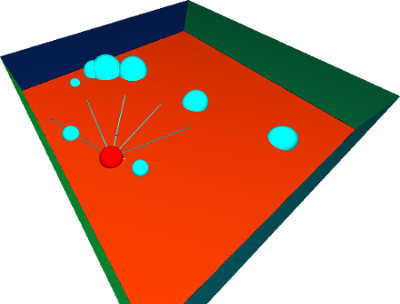
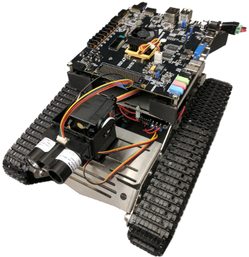

Building a software framework for neurmorphic networks in C++.

The software framework is described here [here](https://neuromorphic.eecs.utk.edu/raw/files/publications/2018-Plank-Framework.pdf), and an example showing the pole balancing application is below.

{#fig-pb}

::: {#fig-robonav layout-ncol=3}

Robonav example. The goal is to navigate the environment using very limited LIDAR measurements without colliding with obstacles.

:::
